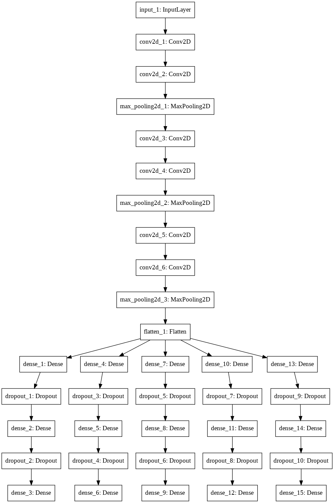

# captchaCracker
This is a keras model(with tensorflow) to decode captcha images.
The dataset is collected from https://www.kaggle.com/fournierp/captcha-version-2-images. For better usability I've splitted the dataset into two folders, train and validation. There is no seperate test set, validation set can be used for testing.

# The Architechture
The Feature extraction stack is made of 6 convolution layers, then there are 6 different classifier with fully connected(Dense) layers to indentify the a specific character each acording to the place of the character in the image.

# predict
I've uploaded the trained model. You can get prediction for an image by calling the prediction.py script, it takes the image name as an argument(give the full path of the image from the script directory).
> python prediction.py ./dataset/validation/7nnnx.png

# Train
To train it on your own dataset just put the pictures in the traing directory, use the filename to label the pictures. And run the train.py script. (This model is made only for characterlength of 5)
